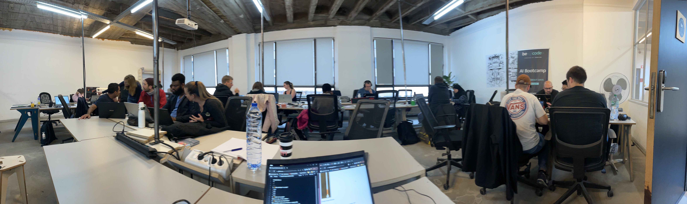

# READMEPLEASE.md
***
---
- - -
#  ✨ Qui participe à ce projet?
* Julie
* Zineb
* Zala
* Jessy
* Cédric
#  ✨ Quel est le projet?
### On en a pas, on fait semblant !

#  ✨ Quand avons-nous bossé dessus?
### le 21 septembre de l'an 2023 :)

#  ✨ Quel était le cadre dans lequel s'est déroullé le projet?
### C'était dans le cadre de notre `formation de junior dev` chez `BeCode`.
### Voici le lien du centre de formation: [BeCode](https://becode.org/campuses/becode-brussels/)

#  ✨ À quoi ressemble ce projet?
### Honnetement à aucun autre...

#  ✨ Où en est le projet?
### Il est terminé.

#  ✨ Que contient le projet?
### Une photo de notre promo

#  ✨ Comment on l'installe?
### Vous n'aurez pas vraiment besoin de l'installer.

#  ✨ D'où vient ce projet?
### Il s'agit d'un exercice pour s'entrainer à manipuler Readme, markdown et github

